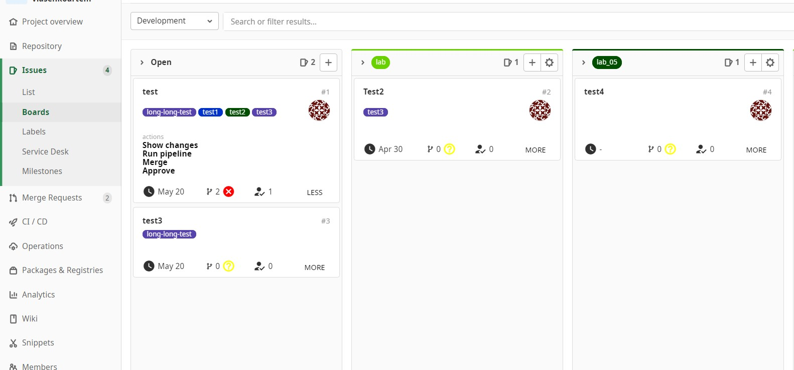
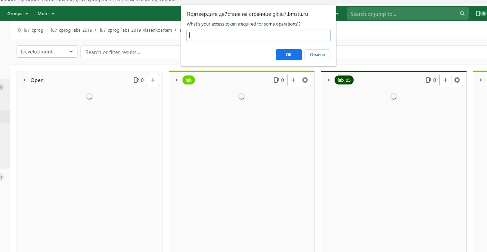
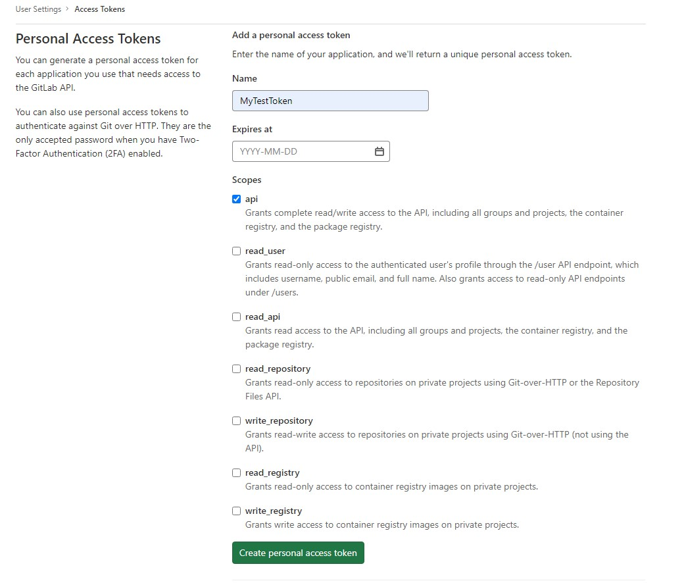

# Qoollab     
Улучшенное отображение карточек в GitLab Issues/Boards.     
      
# Описание     
Расширение, упрощающее работу с issues. Текущая версия для каждого ишью отображает milestone, количество релевантных мёрджей, количество апрувов последнего релевантного мёрджа и статус его пайплайна. В один клик можно перейти в changes мёрджа, проставить approve, замёрджить или перезапустить pipeline. Все действия могут быть совершены при наличии у текущего пользователя соответствующих прав, которые проверяются через access token.      

        

      

# Установка и использование     
В скором времени расширение появится в Google Webstore. Ссылка появится здесь. Для установки достаточно нажать кнопку установить и дождаться соответствующего уведомления об успешной установке в правом верхнем углу. При последующих переходах на страницу */gitlab*/issues/boards скрипт будет запускаться автоматически. Для всех действий на карточке (замёрджить, проставить аппрув, перезапустить пайплайн) необходимо вставить корректный access token в появившийся promt.    
       
       
        
Токен будет сохранён в localStorage и дальше будет автоматически подставляться в promt, поэтому вводить его придётся лишь один раз в сессию. Создать access token можно в настройках профиля в разделе Access Tokens. При недействительном токене действия работать не будут (кроме show changes).       
          
      
       
# Локальная установка
Для локального запуска расширения необходимо скачать архив со сборкой или собрать проект самостоятельно (_npm run build_ в корне проекта). Полученный архив (при локальной сборке он появится в папке _artifacts_) **извлечь в qoollab-v..-production.** Далее в браузере перейти на _Дополнительные инструменты\Расширения_. На открывшейся странице в правом верхнем углу включить _режим разработчика_ и нажать на  кнопку _загрузить распакованное расширение_. Выбрать необходимую папку - qoollab-v..-production. Расширение должно запуститься автоматически.      
      
    
      

