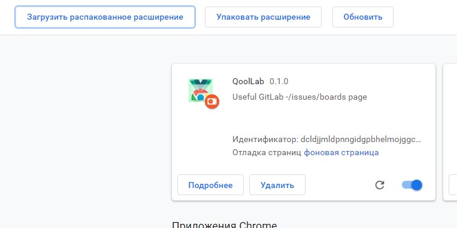

# GitLab boards extension     
Улучшенное отображение карточек в GitLab Issues/Boards.     
      
# Описание     
Расширение, упрощающее работу с issues. Текущая версия дополнительно для каждого ишью отображает milestone, количество релевантных мёрджей, количество апрувов последнего релевантного мёрджа и статус его пайплайна, а также список пользователей, проставивших апрув. В один клик можно перейти в changes или milestone мёрджа, проставить approve/disapprove, замёрджить, отметить как ready/draft. Некоторые действия могут быть совершены только при наличии у текущего пользователя соответствующих прав, которые проверяются через access token. Так же реализована возможность октрыть в новой вкладке развёрнутую с помощью CI/CD ветку (актуально для фронта).      

      

        

    
# Установка 
Beta-версия продукта уже в Google Webstore - [Ссылка](https://chrome.google.com/webstore/detail/qoollab/anomahlklilbgjkcfmndelcbllhnjkcg?hl=ru&authuser=0). Для установки достаточно нажать кнопку "установить" и дождаться соответствующего уведомления об успешной установке в правом верхнем углу. Сразу после установки рекомендуется перейти на страницу настроек расширения.        
          
        
***      
    
***     
      
***       
           
# Настройка
            
      
***       
На странице настройки необходимо настроить список доменов, для которых будет запускаться расширение, частоту обновления карточек, вставить access token и вставить url-ы бэкенда для preview. Токен будет сохранён в localStorage и дальше будет автоматически подставляться. Создать access token можно в настройках профиля GitLab в разделе Access Tokens. При недействительном токене действия из раздела actions работать не будут.     
***     
 
***     
            
# Исползьование       
При последующих переходах на страницу */*/issues/boards, домен которой был указан в настройках скрипт будет запускаться автоматически.
       
***       
             
# Локальная установка
Для локального запуска расширения необходимо скачать архив со сборкой или собрать проект самостоятельно (_npm run build_ в корне проекта). Полученный архив (при локальной сборке он появится в папке _artifacts_) **извлечь в qoollab-v..-production.** Далее в браузере перейти на _Дополнительные инструменты\Расширения_. На открывшейся странице в правом верхнем углу включить _режим разработчика_ и нажать на  кнопку _загрузить распакованное расширение_. Выбрать необходимую папку - qoollab-v..-production. Расширение должно запуститься автоматически.      
***
       
***
      

